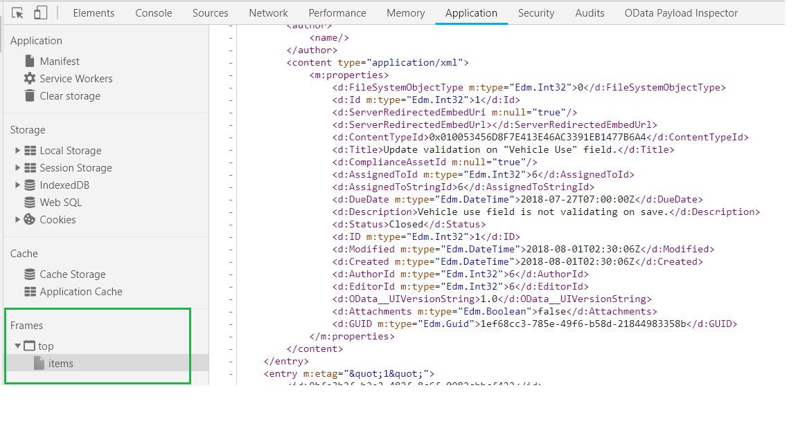

# OData Introduction

1. [View OData Results in Chrome](#-View-OData-Results-in-Chrome)
2. [OData](#-OData)
3. [Query Operations](#-Query-Operations)
4. [Example](#-Example)
5. [Common Operators](#-OData-$filter-Common-Operators)
6. [Exercise](#-Exercise)

## View OData Results in Chrome
Chrome does not display SharePoint XML responses well in the browser. In order to view the response from a REST call,
1. Open Developer Tools in Chrome
2. Navigate to the "Application" tab
3. Expand the "Frames" section in the left navigation panel

    

## OData
OData (Open Data Protocol) defines the best practice for building and consuming RESTful APIs. OData helps you focus on your business logic while building RESTful APIs without having to worry about the approaches to define request and response headers, status codes, HTTP methods, URL conventions, etc...

## Query Operations
OData supports various kinds of query options for querying data.

## Example
We have a Task list that we would like to query using the `SharePoint REST API` and `OData`

1. Display only the `[Title]` and `[DueDate]` fields, return all items

    ```
    http://server/site/_api/web/lists/getbytitle('Tasks')/items?$select=Title,DueDate
    ```

2. Find all list items where `[Status]` equals `In Progress`

    ```
    http://server/site/_api/web/lists/getbytitle('Tasks')/items?$filter=Status eq 'In Progress'
    ```

3. Find tasks that are `Not Started`, ordered by `[DueDate]` ascending

    ```
    http://server/site/_api/web/lists/getbytitle('Tasks')/items?$filter=Status eq 'Not Started'&$orderby=DueDate asc
    ```

4. Display the top 5 tasks ordered by `[Modified]` desc

    ```
    http://server/site/_api/web/lists/getbytitle('Tasks')/items?$top=5&$orderby=Modified desc
    ```

5. Find tasks that are `Not Started`, ordered by `[DueDate]` ascending and display the `[Title]`, `[DueDate]` and `[AssignedTo]` first name, last name and email.

    ```
    http://server/site/_api/web/lists/getbytitle('Tasks')/items?$select=Title,DueDate,AssignedTo/FirstName,AssignedTo/LastName,AssignedTo/EMail&$filter=Status eq 'Not Started'&$orderby=DueDate asc&$expand=AssignedTo/FirstName,AssignedTo/LastName,AssignedTo/EMail
    ```

## OData $filter Common Operators
* Common Operators

    | Operator       | Description           
    | ------------- |-------------
    | Eq    | Equal
    | Ne    | Not Equal      
    | Gt    | Greater than
    | Ge    | Greater than or equal
    | Lt    | Less than
    | Le    | Less than or equal
    | And   | Logical and
    | Or    | Logical or
    | Not   | Logical negation

## Exercise
On your site you will find a `Travel Destinations` list. Use your browser to walk through the following scenarios to query the list using the `SharePoint REST API` and `OData`

1. Display only the `[PassportRequired]` and `[Title]` fields, return all items
2. Find all list items where `[PricingTiers]` equals `Luxury`
3. Find all list items where `[PricingTiers]` equals `Luxury`, ordered by `[Title]` ascending
4. Display the destinations where `Sarah Otto` is the travel agent, order by `[PricingTier]`
5. Find destinations that does NOT require a Passport, and is NOT a `Luxury` destination. Display the top 1 item, ordered by destination. Display the `[Title]`, `[PricingTiers]` and `[TravelAgent]` first name, last name and email.

