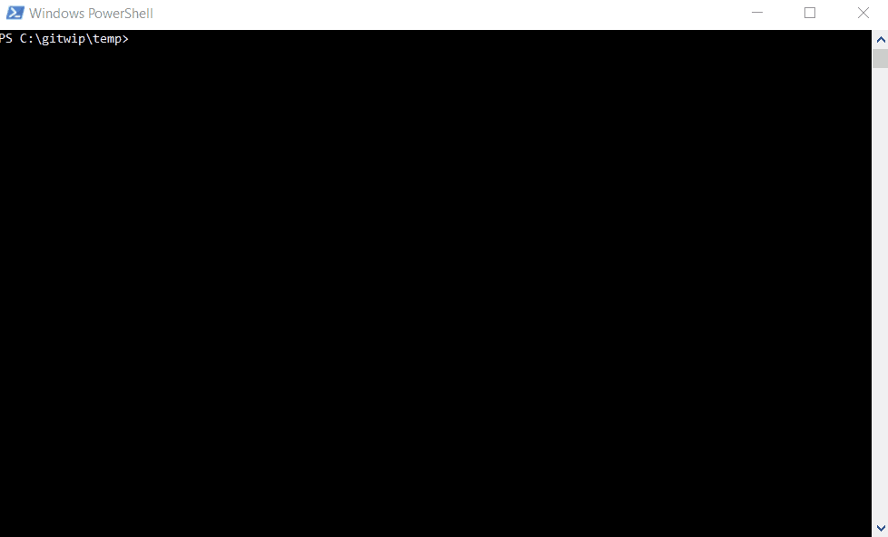

# Your First SPFx Web Part
## 1. Create a new SFPx Project

1. Create a new project directory and navigate to it
```
mkdir webpart-intro
cd webpart-intro
```

2. Install the official SPFx code generator as a tool dependency for the project
```
npm install --save-dev @microsoft/generator-sharepoint
```
3. Run the project generator
```
yo @microsoft/sharepoint
```
**When prompted:**
- Accept the default name
- Select SharePoint Online only (latest), and select Enter.
- Select Use the current folder for where to place the files.
- Select `y` to allow the webpart to be deployed globally
- Select **WebPart** as the client-side component type to be created.
- Accept the default HelloWorld as your web part name, and then select Enter.
- Accept the default HelloWorld description as your web part description, and then select Enter.
- Choose **React** as the framework

At this point Yeoman will take care of creating all of the boilerplate project files as well as install any dependencies.  **It may take a few minutes.**

## 2. Run the Web Part
1. Open up the project folder in VS Code by typing `code .` in your terminal
    - Examine all the code that was generated for you
        - `/package.json`, what dependencies were installed?
        - `/src/webparts/HelloWorld`

> For a information regarding the purpose of each project folder see the **SPFx/Project Structure** page on  the PortalsDevTraining SharePoint site.

2. Switch back to the terminal (making sure you are still in your project directory) and run. **You only need to do this once per machine**
```
gulp trust-dev-cert
```
3. Build & Serve your code so we can see it in the browser
```
gulp serve
```
This should pop open a browser and send you to the **Local Workbench**. Under the hood a lot of stuff is happening

- Compile typescript to JavaScript
- Bundle that JavaScript
- Compile SASS to CSS
- Build the SPFx package (using values found in `/config`)
- Create a local server so SharePoint can pull the code straight from your laptop without having to deploy
- Watch your files, waiting for you to update and save, then automatically rebuild

4. Add the Web Part to the local workbench

    - After running `gulp serve` you should be looking at a browser already opened to your local workbench. 


***Extra Credit*** - Add the webpart to your site's hosted workbench by appending `_layouts/workbench.aspx` to your site url. Ex:
```
https://skylinespark.sharepoint.com/sites/PortalsDevTraining/_layouts/15/workbench.aspx
```

## 3. Build & Package
When we run `gulp serve` SPFx is building and packaging for us already, but in **debug** mode.  We want to explicitly create a build and package from Production.

```
gulp bundle --ship
gulp package-solution --ship
```
- The second command creates the package in the `sharepoint/solution` folder
- You should see a `.sppkg` file in that folder

## 4. Deploy to the Site Collection App Catalog
Now that we have a SPFx package built, we want to deploy it to our SharePoint site collection's App Catalog. This will make our customizations available to all users. 
> Previously the Web Part was only available to ourselves because we were serving the package straight from our laptops.

1. Navigate to your SharePoint Site
    - e.g. `https://skylinespark.sharepoint.com/sites/Oneida-8`
2. **Click the Gear** icon button in the top right, then choose **Site Contents**
3. Under Contents, you should see a list named, **Apps for SharePoint**. Click it to navigate.
4. Upload or drag and drop the `.sppkg` you to the app catalog.
5. **IMPORTANT** - You will get a pop up confirming the deploy, for now *check the box to allow global deployment*
    - We will be talking about this later when discussion deployment options.


## 5. Add the new Web Part to a Modern Page
Now that the SPFx package is deployed to your site collection, you can edit or create a new page and your "Hello World" web part should be available.