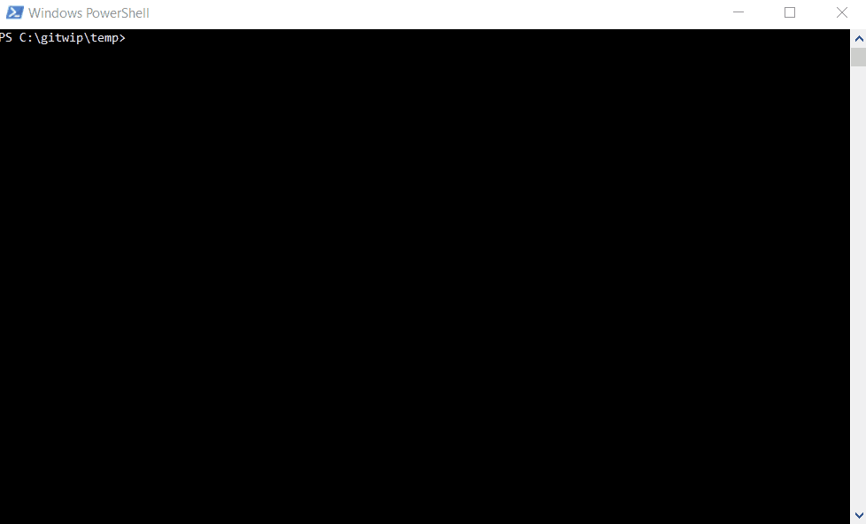

## 1. Create a new SFPx Project
1. Create a new project directory and navigate to it
```
mkdir webpart-intro
cd webpart-intro
```
2. Create a `package.json` file to store your dependencies
```
npm init -y
```
> The `-y` means: *"Don't prompt me 20 times, just create the file using default values."*
- You should see a new `package.json` file created at the root of your project. 
- Feel free to edit any of the values

3. Install the official SPFx code generator as a tool dependency for the project
```
npm install --save-dev @microsoft/generator-sharepoint
```
4. Run the project generator
```
yo @microsoft/sharepoint
```
**When prompted:**
- Accept the default name
- Select SharePoint Online only (latest), and select Enter.
- Select Use the current folder for where to place the files.
- Select `y` to allow the webpart to be deployed globally
- Select **WebPart** as the client-side component type to be created.
- Accept the default HelloWorld as your web part name, and then select Enter.
- Accept the default HelloWorld description as your web part description, and then select Enter.
- Choose **React** as the framework

